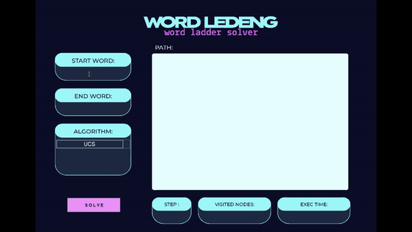

# Tugas Kecil III Strategi Algoritma (IF2211)
## Kelompok Aku Sendiri:
* Muhammad Naufal Aulia 			(13522074)

## Table of Contents
* [Program Word Ledeng](#word)
* [Screenshoot](#screenshoot )
* [Dependencies](#dependencies)
* [How to Use](#how-to-use)


## Word Ledeng: Implementasi Algoritma UCS, Greedy Best First Search, dan A*  <a href="jebir"></a>
>  Word ladder adalah salah satu permainan kata yang terkenal
 bagi seluruh kalangan. Pada permainan ini, pemain diberikan dua kata yang disebut sebagai start word dan end word. Untuk memenangkan permainan, pemain harus menemukan rantai kata yang dapat menghubungkan antara start word dan end word. Banyaknya huruf pada start word dan end word selalu sama. Tiap kata yang berdekatan dalam rantai kata tersebut hanya boleh berbeda satu huruf saja. Pada permainan ini,
 diharapkan solusi optimal, yaitu solusi yang meminimalka banyaknya kata yang dimasukkan pada rantai kata.


Dalam rangka meminimalkan banyaknya kata yang dimasukkan pada rantai kata, digunakanlah algoritma UCS, Greedy Best First Search, dan A* sebagai solver. Algoritma Uniform Cost Search (UCS) merupakan algoritma pencarian graf yang digunakan untuk mencari jalur terpendek dalam suatu graf dengan bobot simpul yang berbeda. Fokusnya terletak pada cost atau biaya terendah yang diukur dari jumlah bobot simpul dari simpul awal ke simpul tujuan. 
Greedy Best-First Search adalah algoritma pencarian graf yang menggunakan fungsi evaluasi f(n) untuk setiap simpul dalam graf dimana fungsi evaluasi f(n) ini didasarkan pada estimasi biaya dari simpul n ke tujuan akhir (goal).
Sedangkan A* (A-star) merupakan algoritma pencarian graf yang digunakan dalam mencari jalur terpendek atau solusi optimal dengan menggabungkan konsep dari dua metrik: biaya sejauh ini g(n) dan estimasi biaya dari simpul n ke tujuan akhir h(n).


## Screenshoot <a href="dokumentasi"></a>


## Dependencies <a href="dependencies"></a>
- Java

## How to Use <a href="how-to-use"></a>
1. Clone repository ini pada link berikut:
    ```
    https://github.com/NopalAul/Tucil3_13522074.git
    ```
2. Buka file directory/location tempat repository berada, kemudian buka folder `src`.
3. Jalankan program dengan cara:
    * Windows: temukan file `run_gui.bat`
        ```
        \Tucil3_13522074\src\run_gui.bat
        ```
        Jalankan program dengan double click pada file `run_gui.bat`

        Atau melalui terminal, ketik:
        ```
        ./run_gui.bat
        ```

    * Linux (possibly MacOS): temukan file `run_gui.sh`
        ```
        \Tucil3_13522074\src\run_gui.sh
        ```

        Berikan izin dengan mengetik:
        ```
        chmod +x run_gui.sh
        ```

        Jalankan program dengan mengetik:
        ```
        ./run_gui.sh
        ```
4. Setelah berjalan, akan langsung terbuka tampilan awal GUI program
5. Pada program, masukkan kata awal pada kolom di bawah `START WORD`, masukkan juga kata tujuan pada kolom di bawah `END WORD`
6. Pilih algoritma yang ingin digunakan pada bagian dropdown `ALGORITHM`, terdapat pilihan algoritma UCS, Greedy Best First Search, dan A*
7. Klik tombol `SOLVE` untuk memulai pencarian
8. Jika pencarian sudah selesai, program akan menampilkan hasil berupa path/rute yang dihasilkan dari start word ke end word, jumlah step/langkah menuju end word, banyaknya node yang dikunjungi, dan waktu eksekusinya
9. Close program untuk mengakhiri